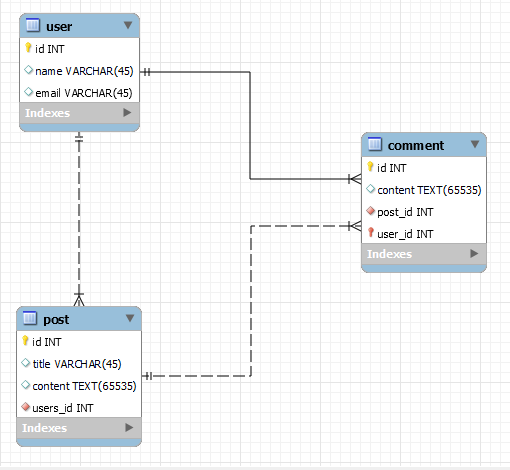

# Relational databases

## Beginning

- Open up XAMPP and start Apache and MySQL
- Go to localhost in you web browser
- Click on phpMyAdmin
- Click SQL.

## Creating a database

Create a database called `module1`

  <!-- prettier-ignore -->

```js
  CREATE DATABASE module1;
```

You have now written your first SQL statement!

## Creating a table

Select the database you just created and click on the SQL tab. Or write `USE module1;` in the SQL tab.

Then create a table called `post` with the collums `id`, `title` and `body`

  <!-- prettier-ignore -->

```sql
  CREATE TABLE post (
    id INT(6) AUTO_INCREMENT PRIMARY KEY,
    title VARCHAR(255) NOT NULL,
    body TEXT(65535) NOT NULL
  );
```

Lets create our first post.

<!-- prettier-ignore -->
```sql
INSERT INTO post (title, body) VALUES ('My first post', 'This is my first post');
```

To get the data back from the database we use the `SELECT` statement.

<!-- prettier-ignore -->
```sql
SELECT * FROM post;
```

Now add some more data to the table.

<!-- prettier-ignore -->
```sql
INSERT INTO post (title, body) VALUES ('My second post', 'This is my second post');
INSERT INTO post (title, body) VALUES ('My third post', 'This is my third post');
INSERT INTO post (title, body) VALUES ('My fourth post', 'This is my fourth post');
```

## Selecting data

To get the data back from the database we use the `SELECT` statement.

<!-- prettier-ignore -->
```sql
SELECT * FROM post
WHERE id = 1;
```

<!-- prettier-ignore -->
```sql
INSERT into post(title, body)
values('see what happens', 'when i create a new one like this');
```

We can now write "searches" to get the data we want.

<!-- prettier-ignore -->
```sql
SELECT * FROM `post` 
WHERE title like '%se%'
```

% sign is a wildcard, so it will return all posts that have the letters se in the title. No matter what is before or after those letters.
Try a new query with the % sign in different places.

To delete a table we use the `DROP` statement.

<!-- prettier-ignore -->
```sql
DROP TABLE post;
```



# Creating the database from model

We will now create the database from the model (2-model.png).

```sql

USE `module1` ;

CREATE TABLE `user` (
  `id` INT NOT NULL AUTO_INCREMENT,
  `name` VARCHAR(45) NULL,
  `email` VARCHAR(45) NULL,
  PRIMARY KEY (`id`)
);


CREATE TABLE `post`(
  `id` INT NOT NULL AUTO_INCREMENT,
  `title` VARCHAR(45) NULL,
  `content` TEXT(65535) NULL,
  `user_id` INT NOT NULL,
  PRIMARY KEY (`id`),
    FOREIGN KEY (`user_id`) REFERENCES `user`(`id`)
   );


CREATE TABLE comment (
  `id` INT NOT NULL AUTO_INCREMENT,
  `content` TEXT(65535) NULL,
  `post_id` INT NOT NULL,
  `user_id` INT NOT NULL,
  PRIMARY KEY (`id`),
    FOREIGN KEY (`post_id`)
    REFERENCES `post`(`id`),
    FOREIGN KEY (`user_id`)
    REFERENCES `user`(`id`));
```

## Inserting users

To insert data into the database we use the `INSERT` statement.

```sql
INSERT INTO `user`(`name`, `email`) VALUES ('Ludvig','ludvig@test.no')

INSERT INTO `user`(`name`, `email`) VALUES ('Eivind','eivind@test.no')

```

## Creating posts

```sql
INSERT INTO `post`(`title`, `content`, `user_id`) VALUES ('test','første test','3')
```

This insert statement will fail because we have a foreign key constraint on the `users_id` column. This means that the value we insert into the `users_id` column must exist in the `id` column of the `user` table. Since we only have created two users with the id's 1 and 2, we can't insert the value 3 into the `users_id` column.

```sql
INSERT INTO `post`(`title`, `content`, `user_id`) VALUES ('test','første test','1')
```

This will work, since the user "Ludvig" has the id 1.

Create a few more users, and posts.

## Join selects.

Now we want to select all the posts a user have created, and change the user id to the users name.

```sql
SELECT `post`.`title`, `post`.`content`, `user`.`name`
FROM `post`
JOIN `user` ON `post`.`user_id` = `user`.`id`
```

## Extra

Try to create a query getting all the comments for a post, and the names of the users who commented.
